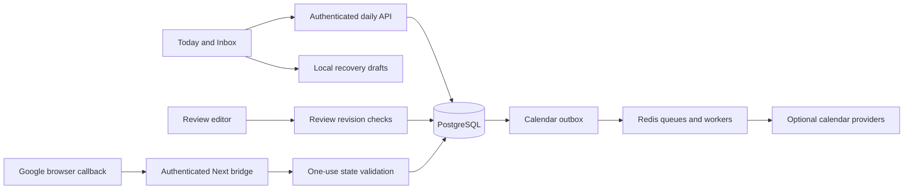

# Daily-use architecture

Browser screens call the authenticated Hono API through typed daily-use contracts. Next's Google bridge is the exception: it receives browser redirects and forwards the Clerk bearer token server-side. PostgreSQL owns task data, revisions, review content, operation receipts and calendar outbox records. Browser storage holds account-scoped recovery drafts only.

Task/subtask UPDATE triggers increment revisions across old and new writers. Capture and movement transactions use an operation receipt to distinguish retries from changed requests; scheduling applies stored proposals with a locked capacity context. Review writes use compare-and-set revision checks. Migration 0007 and the startup SQL constant are equivalent; both clean and populated legacy migration paths are tested.

Subtask date changes remain local rather than silently moving a parent calendar event. Parent task changes generate an outbox record in the same database commit. The dispatcher queues stable event IDs and retains failed deliveries. Google event identity is reserved before the network call, allowing retry after a lost response.

See ADR 0001, the threat model and the build report for tradeoffs, measured checks and limitations.
